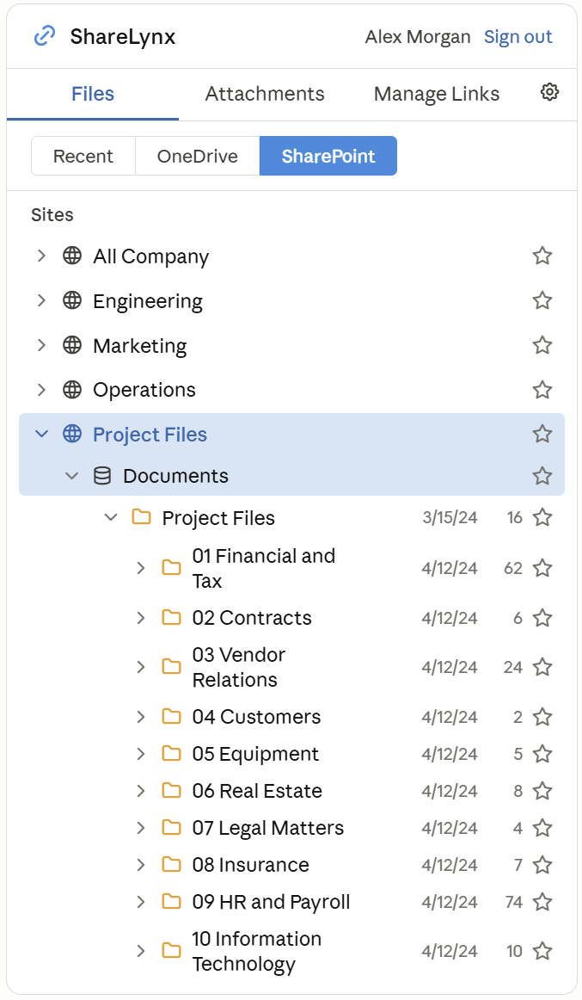
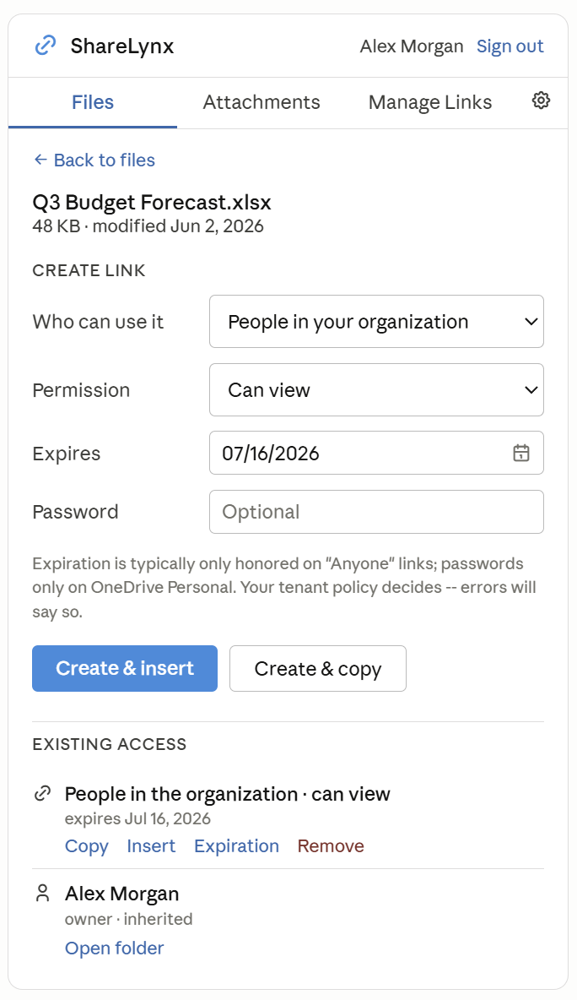
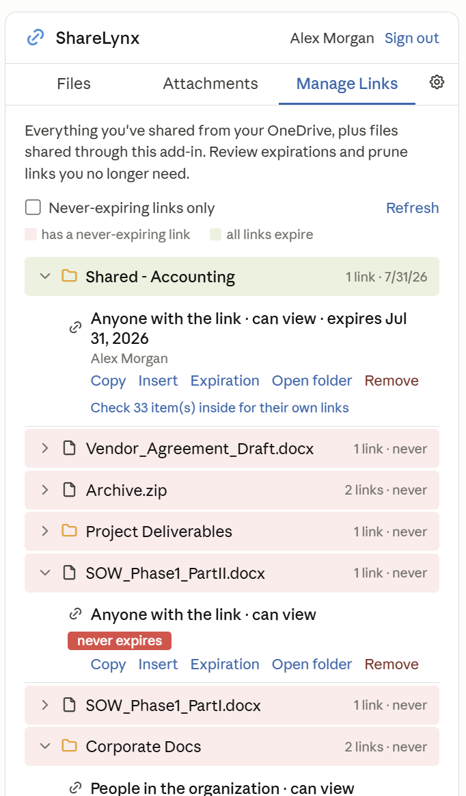

# ShareLynx

**OneDrive and SharePoint sharing, built into Outlook.**

ShareLynx is an Outlook add-in that brings file sharing directly into the compose and reading pane -- no more switching to OneDrive, copying a link, and pasting it back. Browse your files, create sharing links with the right audience and expiration, manage existing links, and convert oversized attachments to links, all without leaving the email you're writing.

Works in classic Outlook for Windows, new Outlook, and Outlook on the web when the client supports the Mailbox 1.12 requirement set used by the on-send Smart Alert. Deploys to any Microsoft 365 tenant with zero per-machine installs.

<p align="center">
  
  &nbsp;&nbsp;
  
  &nbsp;&nbsp;
  
</p>
<p align="center">
  <em>Browse SharePoint sites &nbsp;|&nbsp; Create links with expiration controls &nbsp;|&nbsp; Review and prune shared links</em>
</p>

---

## What it does

### Browse and share files
Pick from recent files, OneDrive, or SharePoint. Navigate with an explorer-style tree view, pin frequently used folders, and optionally land directly in your team's library via admin-configured home directories. Create a sharing link -- choose the audience, permission level, and expiration -- then insert it into your draft or copy it to the clipboard.

### Manage every link you've shared
The Manage Links tab shows everything you've shared from OneDrive, with folder-aware grouping so a shared folder shows as one entry instead of hundreds. Each link displays its audience, permission, and expiration at a glance, with a clear badge on links that never expire. Edit expiration dates, revoke access, or open the source folder -- all in place.

### Convert attachments to links
Select attachments on a draft, and ShareLynx uploads them to OneDrive, creates sharing links with your default settings, swaps out the attachments, and inserts the links into the email body. An on-send alert also warns you when outgoing attachments exceed a size threshold, offering to convert them before the message goes out.

### Tenant policy
Admins can control which link types are available, set organization-wide defaults, and configure home directories -- all through a SharePoint list, no code changes required. Policy is enforced at link creation time, not just hidden in the UI.

---

## Documentation

- [Features](docs/features.md) -- detailed feature reference, policy keys, and known platform limits
- [Architecture](docs/architecture.md) -- how it's built, project layout, security model, data flow
- [Deployment Guide](docs/deployment-guide.md) -- setup, tenant deployment, shipping changes, troubleshooting

## How it's built

Pure client-side -- HTML, CSS, and vanilla JavaScript. No backend and no ShareLynx-hosted database. Host it anywhere that serves HTTPS -- GitHub Pages, Azure Static Web Apps, any static host. Authentication is handled by MSAL.js with Nested App Authentication (NAA) where the host supports it. Tokens are cached in session storage, and all data flows directly between the user's browser and Microsoft Graph using delegated permissions.

The Entra app registration is multi-tenant, so one hosted instance serves every organization. Deploying to a new tenant is just admin consent + manifest upload in the M365 admin center.

---

<details>
<summary><strong>Setup and deployment</strong></summary>

### Publisher setup (one time)

The setup script registers your Entra app and generates `manifest.xml` pointed at your hosting URL.

```powershell
.\setup\ShareLynx_Entra_Setup.ps1 -MultiTenant -BaseUrl https://yourorg.github.io/sharelynx
```

If you omit `-BaseUrl`, the script prompts for it. Host the files anywhere that serves HTTPS (GitHub Pages, Azure Static Web Apps, etc.).

### Deploying to a tenant

Requires a Global Admin (or Application + Exchange admin).

1. **Grant admin consent** -- open the admin-consent URL the setup script prints, signed in as the tenant admin.
2. **Deploy the manifest** -- [M365 admin center](https://admin.microsoft.com) > Settings > Integrated apps > Upload custom apps > Office Add-in > upload `manifest.xml` > assign to users > Deploy.
3. *(Optional)* **Create the policy list** on the tenant's SharePoint root site:
   ```powershell
   .\setup\ShareLynx_Policy_Setup.ps1 -AdminGroupIds "IT Team" -Settings @{ defaultExpDays = "30" }
   ```
4. *(Optional)* **Set home directories** via Exchange custom attributes and/or `spHome:<group>` policy rows.

Users restart Outlook; the ShareLynx button appears on the ribbon.

</details>

<details>
<summary><strong>Tenant policy reference</strong></summary>

Admins configure the add-in through a SharePoint list named `ShareLynx_Policy` on the tenant root site (two text columns: `Title` = key, `SettingValue` = value). Changes take effect at the next user sign-in.

| Key | Controls |
|-|-|
| `allowAnonymousLinks` | allow/deny "Anyone with the link" |
| `adminOnlyAnonymousLinks` | restrict "Anyone" links to policy admins |
| `allowOrganizationLinks` | allow/deny org-wide links |
| `allowSpecificPeopleLinks` | allow/deny specific-people links |
| `defaultScope`, `defaultType`, `defaultExpDays` | tenant defaults for new links |
| `adminGroupIds` | comma-separated group IDs or display names for the admin section |
| `homeAttribute` | Exchange custom attribute slot (1--15) holding each user's home path; default 10 |
| `spHome:<group>` | home path for members of a group, e.g. `Contoso Files/Documents/PROJECTS` |

If no policy list exists, all audiences are available and built-in defaults apply. When a tenant also has `SharePointTenantSettings.Read.All` consented, the add-in mirrors the SharePoint admin center's sharing defaults automatically.

Home directory paths follow the format `Site Name/Library/Folder/...`. Per-user attributes win over group rules. Users can always navigate back up to all sites.

</details>

<details>
<summary><strong>Project layout</strong></summary>

```
manifest.template.xml            Manifest template ({{BASE_URL}} placeholders)
manifest.xml                     Generated by setup script (gitignored)
setup/                           Entra app registration + policy list scripts
src/config.js                    clientId + scopes (committed; not a secret)
src/vendor/msal-browser.min.js   Vendored MSAL (no CDN or npm dependency)
src/taskpane/                    Taskpane UI (HTML/CSS/JS, auth, Graph calls)
src/launchevent/launchevent.js   On-send attachment size alert (ES5)
src/commands/commands.html       Event runtime page for new Outlook / OWA
docs/support.html                Support URL target for the manifest
src/assets/                      Icons
```

</details>

<details>
<summary><strong>Shipping changes</strong></summary>

| Layer | What it hosts | Update speed |
|-|-|-|
| Your static host | the code (`src/**`) | depends on host (GitHub Pages: ~1--2 min) |
| M365 Integrated Apps | the manifest (buttons, permissions, URLs) | up to ~24h, only when `manifest.xml` changes |

Code changes are just a push to your host. Manifest changes must be regenerated, version-bumped, and re-uploaded per tenant; rare. The script is `setup\ShareLynx_Entra_Setup.ps1`, for example:

```powershell
.\setup\ShareLynx_Entra_Setup.ps1 -MultiTenant -BaseUrl https://sfncadmin.github.io/sharelynx
```

The script does not bump the manifest version automatically; update `<Version>` in `manifest.template.xml` before regenerating `manifest.xml`.

**Stale pane after a push:** Outlook's WebView2 caches old JS. Fix: close/reopen the task pane, restart Outlook, or clear `%LOCALAPPDATA%\Microsoft\Office\16.0\Wef\` while Outlook is closed.

</details>

<details>
<summary><strong>Known platform limits</strong></summary>

These are Microsoft Graph / SharePoint Online constraints, not bugs:

- **"Anyone" links** fail if anonymous sharing is disabled in the SharePoint admin center.
- **Expiration** is generally only honored on "Anyone" links (SharePoint Online policy).
- **Password-protected links** are OneDrive Personal only in Graph v1.0.
- **Block download** isn't exposed in Graph v1.0 `createLink`.
- The on-send alert uses the Mailbox 1.12 requirement set. Older Outlook clients can be blocked by the manifest even if the task pane code would otherwise run.
- The on-send alert threshold is read via roamingSettings; changes apply after Outlook reloads the add-in.

</details>

<details>
<summary><strong>Troubleshooting</strong></summary>

- **Sign-in errors**: confirm admin consent was granted in the user's tenant and the redirect URIs on the app registration include the hosting URL.
- **Policy not applying**: the list must be named `ShareLynx_Policy` on the tenant root site with `Title`/`SettingValue` text columns; policy loads at sign-in.
- **Smart Alert not firing**: confirm the Outlook client supports Mailbox 1.12 / event-based activation, the add-in loaded, and the threshold isn't 0.
- **Add-in button missing**: Integrated Apps propagation can take hours on first deploy; confirm the user is in the assigned group, then restart Outlook.

</details>

---

## Roadmap

- Snapshot-style links (frozen copy at send time, so edits to the original don't change what the recipient sees)
- Inline education (info tooltips explaining each sharing choice in plain language)
- Protected storage for converted attachments (org-managed library so links survive folder cleanup and user offboarding)
- View density toggle (compact vs. comfortable with thumbnails)
- Block-download links (Graph beta / SharePoint REST)
- Drag-and-drop upload
- Auto-convert on send (skip the warning, just do it)
- Dark mode
